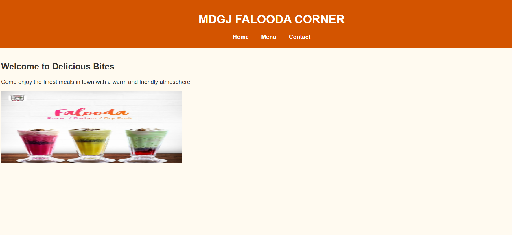
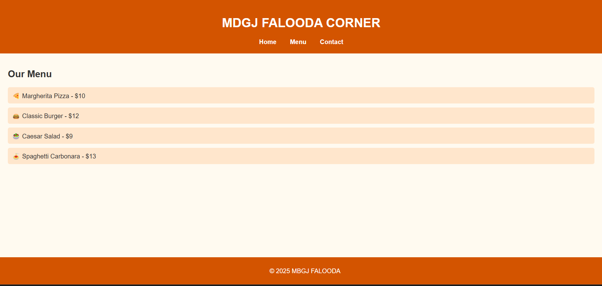
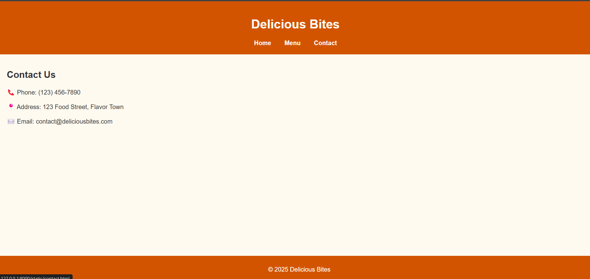

# Ex.07 Restaurant Website
## Date:09.05.25

## AIM:
To develop a static Restaurant website to display the food items and services provided by them.

## DESIGN STEPS:

### Step 1:
Requirement collection.

### Step 2:
Creating the layout using HTML and CSS.

### Step 3:
Updating the sample content.

### Step 4:
Choose the appropriate style and color scheme.

### Step 5:
Validate the layout in various browsers.

### Step 6:
Validate the HTML code.

### Step 7:
Publish the website in the given URL.

## PROGRAM:

```
home.html
<!DOCTYPE html>
<html lang="en">
<head>
  <meta charset="UTF-8" />
  <title>Home - MDGJ FALOODA CORNER</title>
  <link rel="stylesheet" href="style.css" />
</head>
<body>
  <header>
    <h1>MDGJ FALOODA CORNER</h1>
    <nav>
      <a href="home.html">Home</a>
      <a href="menu.html">Menu</a>
      <a href="contact.html">Contact</a>
    </nav>
  </header>
  <main>
    <h2>Welcome to Delicious Bites</h2>
    <p>Come enjoy the finest meals in town with a warm and friendly atmosphere.</p>
    
  </main>
  <footer>
    <p>&copy; 2025 MDGJ FALOODA CORNER</p>
  </footer>
</body>
</html>

menu.html
<!DOCTYPE html>
<html lang="en">
<head>
  <meta charset="UTF-8" />
  <title>Menu - MDGJ FALOODA CORNER</title>
  <link rel="stylesheet" href="style.css" />
</head>
<body>
  <header>
    <h1>MDGJ FALOODA CORNER</h1>
    <nav>
      <a href="home.html">Home</a>
      <a href="menu.html">Menu</a>
      <a href="contact.html">Contact</a>
    </nav>
  </header>
  <main>
    <h2>Our Menu</h2>
    <ul>
      <li>🍕 Margherita Pizza - $10</li>
      <li>🍔 Classic Burger - $12</li>
      <li>🥗 Caesar Salad - $9</li>
      <li>🍝 Spaghetti Carbonara - $13</li>
    </ul>
  </main>
  <footer>
    <p>&copy; 2025 MBGJ FALOODA</p>
  </footer>
</body>
</html>
contact.html
<!DOCTYPE html>
<html lang="en">
<head>
  <meta charset="UTF-8" />
  <title>Contact - Delicious Bites</title>
  <link rel="stylesheet" href="style.css" />
</head>
<body>
  <header>
    <h1>Delicious Bites</h1>
    <nav>
      <a href="home.html">Home</a>
      <a href="menu.html">Menu</a>
      <a href="contact.html">Contact</a>
    </nav>
  </header>
  <main>
    <h2>Contact Us</h2>
    <p>📞 Phone: (123) 456-7890</p>
    <p>📍 Address: 123 Food Street, Flavor Town</p>
    <p>✉️ Email: contact@deliciousbites.com</p>
  </main>
  <footer>
    <p>&copy; 2025 Delicious Bites</p>
  </footer>
</body>
</html>
style.css
body {
    font-family: Arial, sans-serif;
    margin: 0;
    padding: 0;
    background: #fffaf0;
    color: #333;
  }
  
  header {
    background-color: #d35400;
    color: white;
    padding: 20px;
    text-align: center;
  }
  
  nav a {
    margin: 0 15px;
    color: white;
    text-decoration: none;
    font-weight: bold;
  }
  
  nav a:hover {
    text-decoration: underline;
  }
  
  main {
    padding: 20px;
  }
  
  footer {
    text-align: center;
    padding: 10px;
    background-color: #d35400;
    color: white;
    position: fixed;
    width: 100%;
    bottom: 0;
  }
  
  ul {
    list-style: none;
    padding: 0;
  }
  
  ul li {
    padding: 10px;
    background: #ffe6cc;
    margin-bottom: 10px;
    border-radius: 5px;
  }
```
## OUTPUT:




## RESULT:
The program for designing software company website using HTML and CSS is completed successfully.
